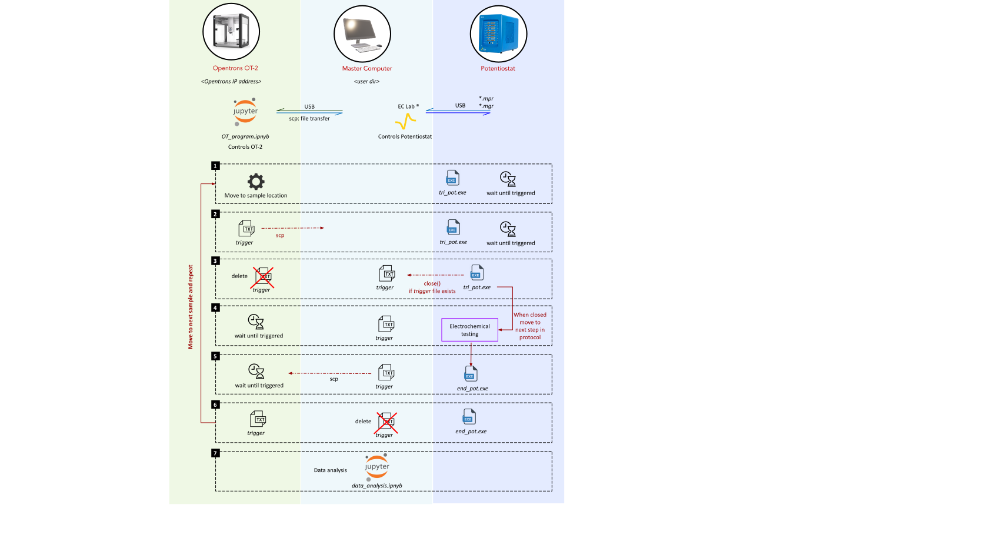

**Communication and triggering mechanism**

The triggering mechanism employed in this study is illustrated in the figure below. This represents a straightforward method for setting up a communication protocol between the OT-2, the master computer, and the Biologic potentiostat avoiding the need for extensive coding or complex modifications. It's important to note that there may be other effective methods for establishing this communication that we have not investigated. Additionally, using different equipment, such as substituting the OT-2 with another pipetting or gantry system, or replacing the Biologic potentiostat with a different model, would require alternative communication and triggering protocols. The current protocol functions as follows:

1. **Initialization**
    - EC-Lab® is opened and the following protocol is loaded and ran:

            **Technique : 1**

            External Application

            _trig_pot.exe_

            **Technique : 2**

            Open Circuit Voltage (OCV)

            **Technique : 3**

            Cyclic Voltammetry Advanced (CVA)

            **Technique : 4**

            Potentio Electrochemical Impedance Spectroscopy (PEIS)

            0V

            **Technique : 5**

            Linear Sweep Voltammetry (LSV)

            **Technique : 6**

            Chronopotentiometry (CP)

            **Technique : 7**

            External Application

            _end_pot.exe_

            **Technique : 9**

            Loop

Go to technique 1 and repeat n times 15

EC-Lab® runs the first technique: “trig_pot.exe” . It basically holds proceeding to the next technique before a _trigger_ file is sent to the master computer in the _&lt;user dir&gt;_.
    - The “_OT_program.ipnyb_” is started on the OT-2 local Jupyter host and ran.
    - The OT-2 robot moves to the first sample and pauses. It will wait before moving to the next sample until it is triggered again.
    - The “_OT_program.ipnyb_” sends a trigger file from the local Jupyter notebook host to the master computer and then deletes the file locally.
    - To learn about how OT-2 ssh files to the master computer check: <https://support.opentrons.com/s/article/Setting-up-SSH-access-to-your-OT-2>  

1. **Execution of Electrochemical Test:**
    - Once the _trigger_ file is received at the master computer. “trig_pot.exe” closes and technique 2 in the protocol is started.
    - EC-Lab® goes through technique 2 to 6 to complete the electrochemical test.
2. **Final Steps and Looping:**
    - In technique 7, “_end_pot.exe_” is launched (Code block 2).
    - This sends the _trigger_ file back to the OT-2 via the master computer and then deletes it from the master computer.
    - This triggers the OT-2 to move to the next sample. The process repeats until all samples are processed.

**Figure.** A diagram explaining the triggering mechanism.

The software for “tri_pot.exe” and “end_pot.exe” is written in python here: [trig_pot.py](trig_pot.py) and [end_pot.py](end_pot.py) and then converted to an .exe package using PyInstaller: <https://pyinstaller.org/>